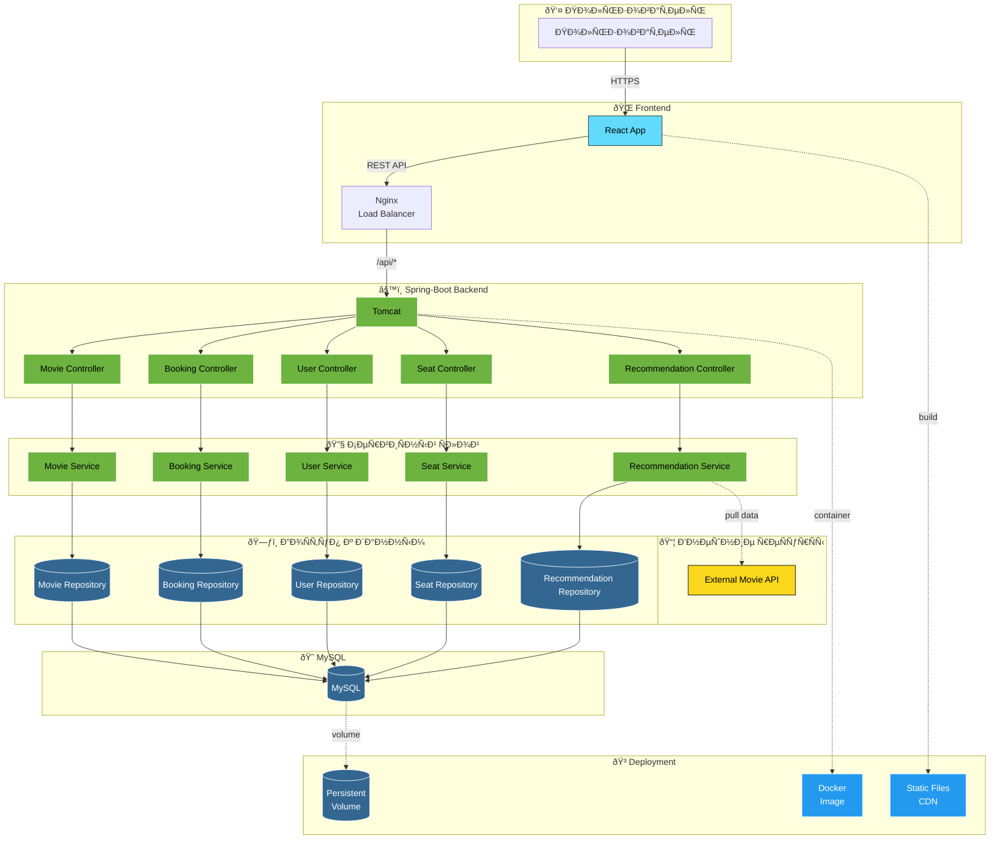

```mermaid
graph TB
    subgraph "👤 Пользователь"
        U[Пользователь]
    end

    %% ---------- Frontend ----------
    subgraph "🌠Frontend"
        U --> |HTTPS| RA[React App<br/>]
        RA --> |REST API| GLB
    end

    %% ---------- Gateway / LB ----------
    GLB[Nginx<br/>Load Balancer]

    %% ---------- Backend ----------
    subgraph "âš™ï¸ Spring-Boot Backend"
        GLB --> |/api/*| SB[Tomcat]
        SB --> MC[Movie Controller]
        SB --> BC[Booking Controller]
        SB --> UC[User Controller]
        SB --> SC[Seat Controller]
        SB --> RC[Recommendation Controller]
    end

    %% ---------- Services ----------
    subgraph "🔧 СервиÑный Ñлой"
        MC --> MS[Movie Service]
        BC --> BS[Booking Service]
        UC --> US[User Service]
        SC --> SS[Seat Service]
        RC --> RS[Recommendation Service]
    end

    %% ---------- Repositories ----------
    subgraph "ðŸ—ƒï¸ Ð”Ð¾Ñтуп к данным"
        MS --> MR[(Movie Repository)]
        BS --> BR[(Booking Repository)]
        US --> UR[(User Repository)]
        SS --> SR[(Seat Repository)]
        RS --> RR[(Recommendation Repository)]
    end

    %% ---------- База ----------
    subgraph "😠MySQL"
        MR --> DB[(MySQL)]
        BR --> DB
        UR --> DB
        SR --> DB
        RR --> DB
    end

    %% ---------- Внешние компоненты ----------
    subgraph "📦 Внешние реÑурÑÑ‹"
        RS -.-> |pull data| EXT[External Movie API]
    end

    %% ---------- Deployment ----------
    subgraph "🳠Deployment"
        RA -.-> |build| STAT[Static Files<br/>CDN]
        SB -.-> |container| DOCK[Docker<br/>Image]
        DB -.-> |volume| VOL[(Persistent<br/>Volume)]
    end

    classDef frontend fill:#61dafb,stroke:#282c34,color:#000
    classDef backend fill:#6db33f,stroke:#fff,color:#000
    classDef db fill:#336791,stroke:#fff,color:#fff
    classDef external fill:#f9d71c,stroke:#000,color:#000
    classDef deployment fill:#239aef,stroke:#fff,color:#fff

    class RA frontend
    class SB,MC,BC,UC,SC,RC,MS,BS,US,SS,RS backend
    class DB,MR,BR,UR,SR,RR,VOL db
    class EXT external
    class STAT,DOCK deployment
```