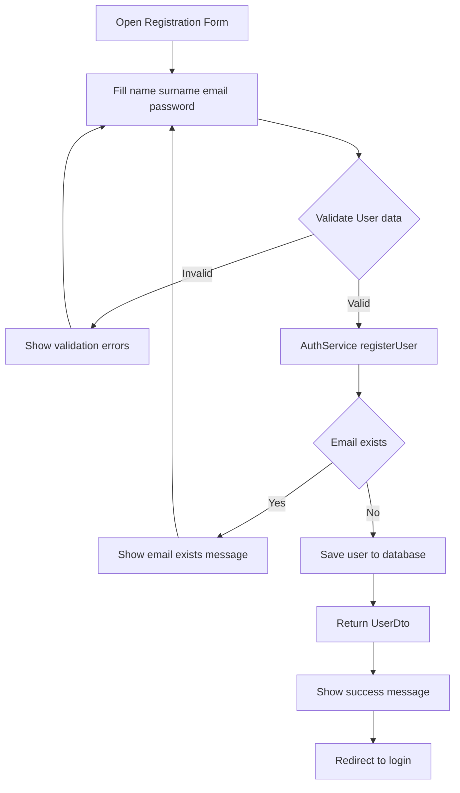
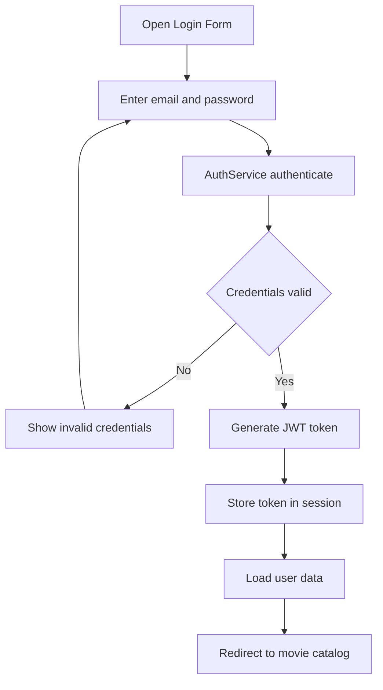
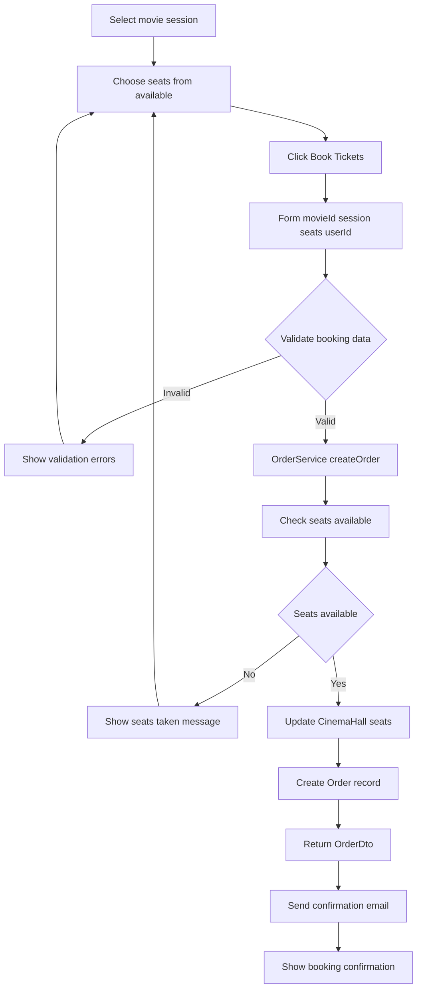

# 📊 Диаграммы активностей

### 1. Регистрация пользователя

```mermaid
flowchart TD
    A[Open Registration Form]
    A --> B[Fill name surname email password]
    B --> C{Validate User data}
    C -->|Invalid| D[Show validation errors]
    D --> B
    C -->|Valid| E[AuthService registerUser]
    E --> F{Email exists}
    F -->|Yes| G[Show email exists message]
    G --> B
    F -->|No| H[Save user to database]
    H --> I[Return UserDto]
    I --> J[Show success message]
    J --> K[Redirect to login]
```

### 2. Авторизация пользователя

```mermaid
flowchart TD
    A[Open Login Form]
    A --> B[Enter email and password]
    B --> C[AuthService authenticate]
    C --> D{Credentials valid}
    D -->|No| E[Show invalid credentials]
    E --> B
    D -->|Yes| F[Generate JWT token]
    F --> G[Store token in session]
    G --> H[Load user data]
    H --> I[Redirect to movie catalog]
```

### 3. Бронирование билетов

```mermaid
flowchart TD
    A[Select movie session]
    A --> B[Choose seats from available]
    B --> C[Click Book Tickets]
    C --> D[Form movieId session seats userId]
    D --> E{Validate booking data}
    E -->|Invalid| F[Show validation errors]
    F --> B
    E -->|Valid| G[OrderService createOrder]
    G --> H[Check seats available]
    H --> I{Seats available}
    I -->|No| J[Show seats taken message]
    J --> B
    I -->|Yes| K[Update CinemaHall seats]
    K --> L[Create Order record]
    L --> M[Return OrderDto]
    M --> N[Send confirmation email]
    N --> O[Show booking confirmation]
```