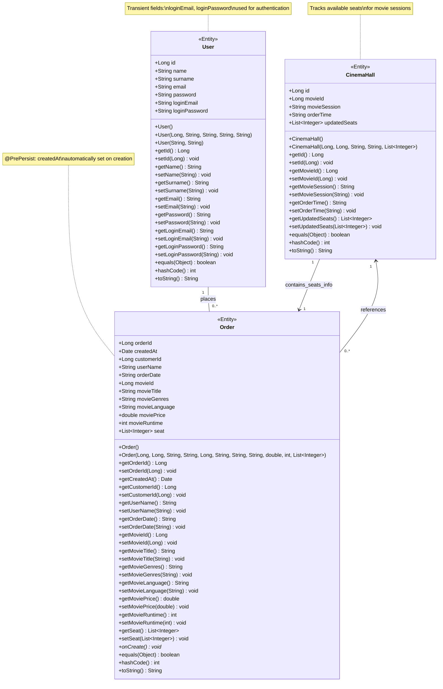

# 📊 Диаграмма классов

```mermaid
classDiagram
    class CinemaHall {
        <<Entity>>
        +Long id
        +Long movieId
        +String movieSession
        +String orderTime
        +List~Integer~ updatedSeats
        +CinemaHall()
        +CinemaHall(Long, Long, String, String, List~Integer~)
        +getId() Long
        +setId(Long) void
        +getMovieId() Long
        +setMovieId(Long) void
        +getMovieSession() String
        +setMovieSession(String) void
        +getOrderTime() String
        +setOrderTime(String) void
        +getUpdatedSeats() List~Integer~
        +setUpdatedSeats(List~Integer~) void
        +equals(Object) boolean
        +hashCode() int
        +toString() String
    }

    class Order {
        <<Entity>>
        +Long orderId
        +Date createdAt
        +Long customerId
        +String userName
        +String orderDate
        +Long movieId
        +String movieTitle
        +String movieGenres
        +String movieLanguage
        +double moviePrice
        +int movieRuntime
        +List~Integer~ seat
        +Order()
        +Order(Long, Long, String, String, Long, String, String, String, double, int, List~Integer~)
        +getOrderId() Long
        +setOrderId(Long) void
        +getCreatedAt() Date
        +getCustomerId() Long
        +setCustomerId(Long) void
        +getUserName() String
        +setUserName(String) void
        +getOrderDate() String
        +setOrderDate(String) void
        +getMovieId() Long
        +setMovieId(Long) void
        +getMovieTitle() String
        +setMovieTitle(String) void
        +getMovieGenres() String
        +setMovieGenres(String) void
        +getMovieLanguage() String
        +setMovieLanguage(String) void
        +getMoviePrice() double
        +setMoviePrice(double) void
        +getMovieRuntime() int
        +setMovieRuntime(int) void
        +getSeat() List~Integer~
        +setSeat(List~Integer~) void
        +onCreate()* void
        +equals(Object) boolean
        +hashCode() int
        +toString() String
    }

    class User {
        <<Entity>>
        +Long id
        +String name
        +String surname
        +String email
        +String password
        +String loginEmail
        +String loginPassword
        +User()
        +User(Long, String, String, String, String)
        +User(String, String)
        +getId() Long
        +setId(Long) void
        +getName() String
        +setName(String) void
        +getSurname() String
        +setSurname(String) void
        +getEmail() String
        +setEmail(String) void
        +getPassword() String
        +setPassword(String) void
        +getLoginEmail() String
        +setLoginEmail(String) void
        +getLoginPassword() String
        +setLoginPassword(String) void
        +equals(Object) boolean
        +hashCode() int
        +toString() String
    }

    %% ---- Associations ----
    User "1" -- "0..*" Order : places
    Order "0..*" --> "1" CinemaHall : references
    CinemaHall "1" --> "1" Order : contains_seats_info
    
    %% ---- Notes ----
    note for User "Transient fields:\nloginEmail, loginPassword\nused for authentication"
    note for Order "@PrePersist: createdAt\nautomatically set on creation"
    note for CinemaHall "Tracks available seats\nfor movie sessions"
```