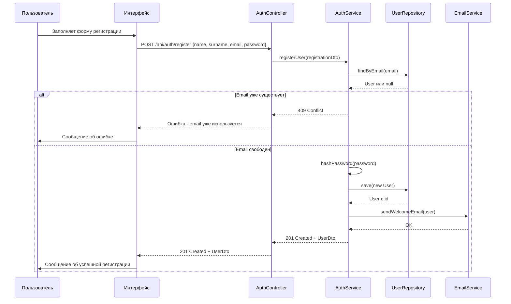
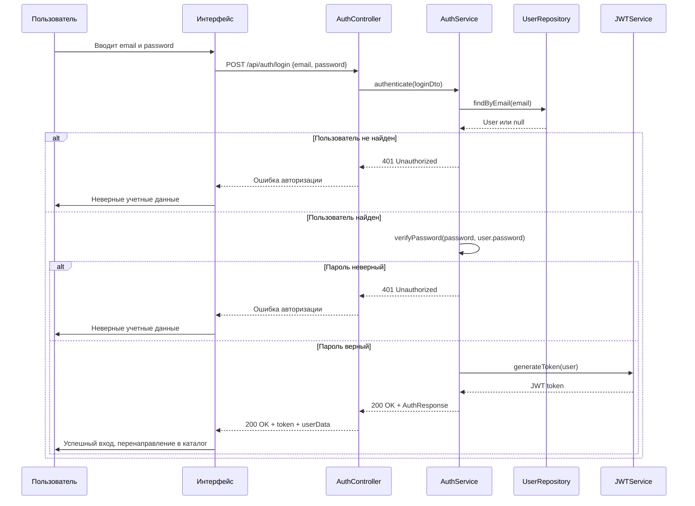
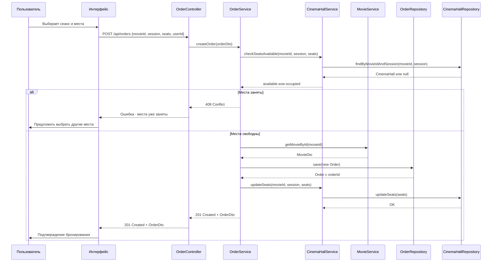

# 📊 Диаграммы последовательностей

### 1. Регистрация пользователя

```mermaid
sequenceDiagram
    participant User as Пользователь
    participant Frontend as Интерфейс
    participant Auth as AuthController
    participant AuthService as AuthService
    participant UserRepo as UserRepository
    participant EmailService as EmailService

    User->>Frontend: Заполняет форму регистрации
    Frontend->>Auth: POST /api/auth/register {name, surname, email, password}
    Auth->>AuthService: registerUser(registrationDto)
    
    AuthService->>UserRepo: findByEmail(email)
    UserRepo-->>AuthService: User или null
    
    alt Email уже существует
        AuthService-->>Auth: 409 Conflict
        Auth-->>Frontend: Ошибка - email уже используется
        Frontend->>User: Сообщение об ошибке
    else Email свободен
        AuthService->>AuthService: hashPassword(password)
        AuthService->>UserRepo: save(new User)
        UserRepo-->>AuthService: User с id
        AuthService->>EmailService: sendWelcomeEmail(user)
        EmailService-->>AuthService: OK
        AuthService-->>Auth: 201 Created + UserDto
        Auth-->>Frontend: 201 Created + UserDto
        Frontend->>User: Сообщение об успешной регистрации
    end
```

### 2. Авторизация пользователя

```mermaid
sequenceDiagram
    participant User as Пользователь
    participant Frontend as Интерфейс
    participant Auth as AuthController
    participant AuthService as AuthService
    participant UserRepo as UserRepository
    participant JWTService as JWTService

    User->>Frontend: Вводит email и password
    Frontend->>Auth: POST /api/auth/login {email, password}
    Auth->>AuthService: authenticate(loginDto)
    
    AuthService->>UserRepo: findByEmail(email)
    UserRepo-->>AuthService: User или null
    
    alt Пользователь не найден
        AuthService-->>Auth: 401 Unauthorized
        Auth-->>Frontend: Ошибка авторизации
        Frontend->>User: Неверные учетные данные
    else Пользователь найден
        AuthService->>AuthService: verifyPassword(password, user.password)
        alt Пароль неверный
            AuthService-->>Auth: 401 Unauthorized
            Auth-->>Frontend: Ошибка авторизации
            Frontend->>User: Неверные учетные данные
        else Пароль верный
            AuthService->>JWTService: generateToken(user)
            JWTService-->>AuthService: JWT token
            AuthService-->>Auth: 200 OK + AuthResponse
            Auth-->>Frontend: 200 OK + token + userData
            Frontend->>User: Успешный вход, перенаправление в каталог
        end
    end
```

### 3. Бронирование билетов

```mermaid
sequenceDiagram
    participant User as Пользователь
    participant Frontend as Интерфейс
    participant Order as OrderController
    participant OrderService as OrderService
    participant CinemaHall as CinemaHallService
    participant Movie as MovieService
    participant OrderRepo as OrderRepository
    participant CinemaHallRepo as CinemaHallRepository

    User->>Frontend: Выбирает сеанс и места
    Frontend->>Order: POST /api/orders {movieId, session, seats, userId}
    Order->>OrderService: createOrder(orderDto)
    
    OrderService->>CinemaHall: checkSeatsAvailable(movieId, session, seats)
    CinemaHall->>CinemaHallRepo: findByMovieIdAndSession(movieId, session)
    CinemaHallRepo-->>CinemaHall: CinemaHall или null
    CinemaHall-->>OrderService: available или occupied
    
    alt Места заняты
        OrderService-->>Order: 409 Conflict
        Order-->>Frontend: Ошибка - места уже заняты
        Frontend->>User: Предложить выбрать другие места
    else Места свободны
        OrderService->>Movie: getMovieById(movieId)
        Movie-->>OrderService: MovieDto
        OrderService->>OrderRepo: save(new Order)
        OrderRepo-->>OrderService: Order с orderId
        
        OrderService->>CinemaHall: updateSeats(movieId, session, seats)
        CinemaHall->>CinemaHallRepo: updateSeats(seats)
        CinemaHallRepo-->>CinemaHall: OK
        
        OrderService-->>Order: 201 Created + OrderDto
        Order-->>Frontend: 201 Created + OrderDto
        Frontend->>User: Подтверждение бронирования
    end
```