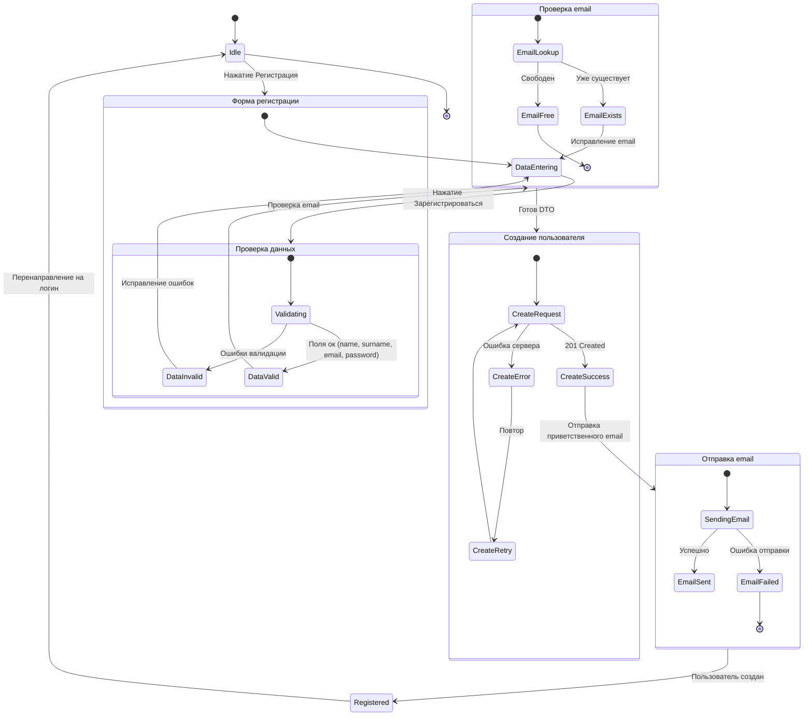
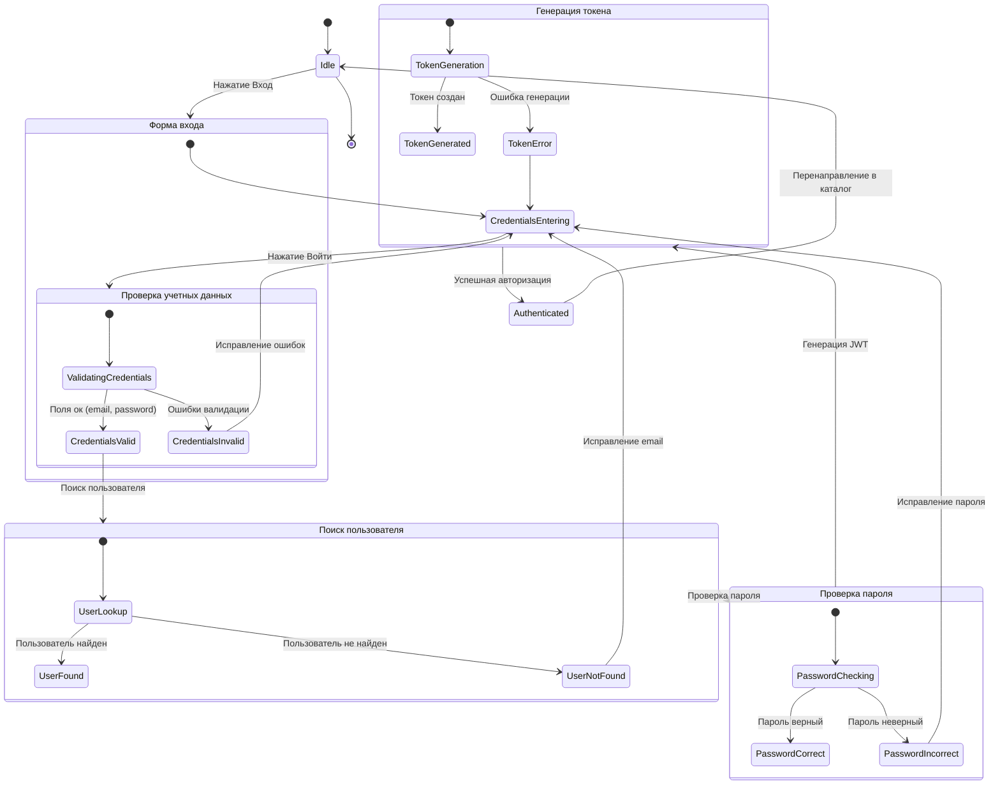
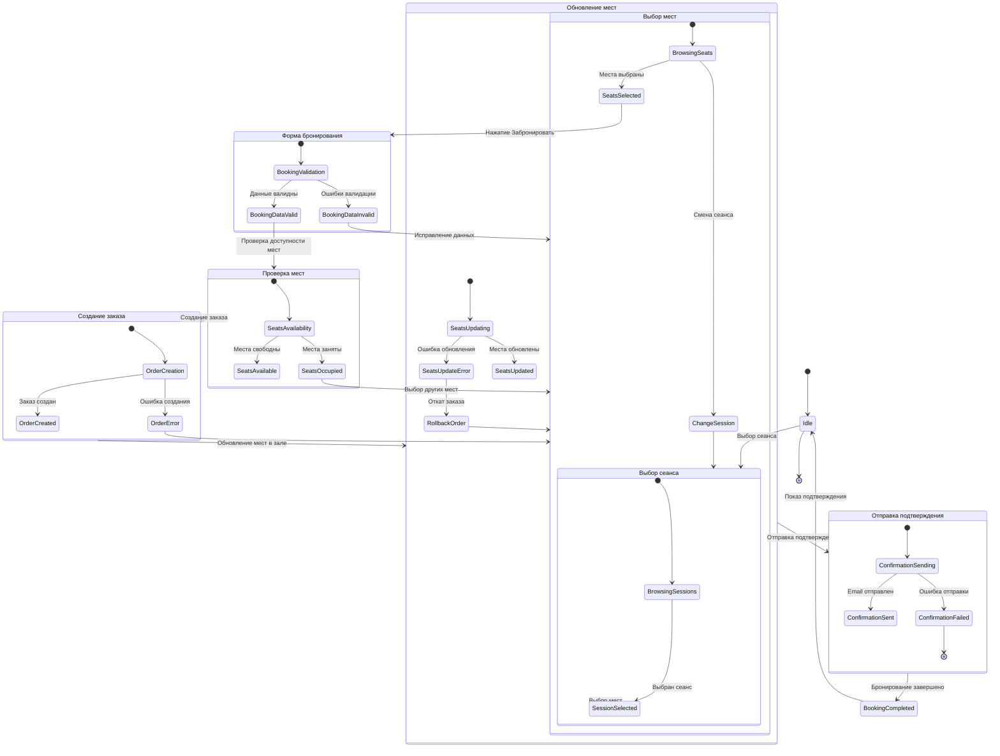

# 📊 Диаграммы состояний

### 1. Регистрация пользователя

```mermaid
stateDiagram-v2
    [*] --> Idle
    Idle --> RegistrationForm : Нажатие Регистрация

    state "Форма регистрации" as RegistrationForm {
        [*] --> DataEntering
        DataEntering --> DataValidation : Нажатие Зарегистрироваться
    }

    state "Проверка данных" as DataValidation {
        [*] --> Validating
        Validating --> DataValid : Поля ок (name, surname, email, password)
        Validating --> DataInvalid : Ошибки валидации
        DataInvalid --> DataEntering : Исправление ошибок
    }

    DataValid --> CheckEmail : Проверка email

    state "Проверка email" as CheckEmail {
        [*] --> EmailLookup
        EmailLookup --> EmailExists : Уже существует
        EmailLookup --> EmailFree : Свободен
        EmailExists --> DataEntering : Исправление email
        EmailFree --> [*]
    }

    CheckEmail --> SendingCreate : Готов DTO

    state "Создание пользователя" as SendingCreate {
        [*] --> CreateRequest
        CreateRequest --> CreateSuccess : 201 Created
        CreateRequest --> CreateError : Ошибка сервера
        CreateError --> CreateRetry : Повтор
        CreateRetry --> CreateRequest
    }

    CreateSuccess --> SendEmail : Отправка приветственного email

    state "Отправка email" as SendEmail {
        [*] --> SendingEmail
        SendingEmail --> EmailSent : Успешно
        SendingEmail --> EmailFailed : Ошибка отправки
        EmailFailed --> [*]
    }

    SendEmail --> Registered : Пользователь создан
    Registered --> Idle : Перенаправление на логин

    Idle --> [*]
```

### 2. Авторизация пользователя

```mermaid
stateDiagram-v2
    [*] --> Idle
    Idle --> LoginForm : Нажатие Вход

    state "Форма входа" as LoginForm {
        [*] --> CredentialsEntering
        CredentialsEntering --> CredentialsValidation : Нажатие Войти
    }

    state "Проверка учетных данных" as CredentialsValidation {
        [*] --> ValidatingCredentials
        ValidatingCredentials --> CredentialsValid : Поля ок (email, password)
        ValidatingCredentials --> CredentialsInvalid : Ошибки валидации
        CredentialsInvalid --> CredentialsEntering : Исправление ошибок
    }

    CredentialsValid --> CheckUser : Поиск пользователя

    state "Поиск пользователя" as CheckUser {
        [*] --> UserLookup
        UserLookup --> UserFound : Пользователь найден
        UserLookup --> UserNotFound : Пользователь не найден
        UserNotFound --> CredentialsEntering : Исправление email
    }

    CheckUser --> VerifyPassword : Проверка пароля

    state "Проверка пароля" as VerifyPassword {
        [*] --> PasswordChecking
        PasswordChecking --> PasswordCorrect : Пароль верный
        PasswordChecking --> PasswordIncorrect : Пароль неверный
        PasswordIncorrect --> CredentialsEntering : Исправление пароля
    }

    VerifyPassword --> GenerateToken : Генерация JWT

    state "Генерация токена" as GenerateToken {
        [*] --> TokenGeneration
        TokenGeneration --> TokenGenerated : Токен создан
        TokenGeneration --> TokenError : Ошибка генерации
        TokenError --> CredentialsEntering
    }

    GenerateToken --> Authenticated : Успешная авторизация
    Authenticated --> Idle : Перенаправление в каталог

    Idle --> [*]
```

### 3. Бронирование билетов

```mermaid
stateDiagram-v2
    [*] --> Idle
    Idle --> SessionSelection : Выбор сеанса

    state "Выбор сеанса" as SessionSelection {
        [*] --> BrowsingSessions
        BrowsingSessions --> SessionSelected : Выбран сеанс
    }

    SessionSelected --> SeatSelection : Выбор мест

    state "Выбор мест" as SeatSelection {
        [*] --> BrowsingSeats
        BrowsingSeats --> SeatsSelected : Места выбраны
        BrowsingSeats --> ChangeSession : Смена сеанса
        ChangeSession --> SessionSelection
    }

    SeatsSelected --> BookingForm : Нажатие Забронировать

    state "Форма бронирования" as BookingForm {
        [*] --> BookingValidation
        BookingValidation --> BookingDataValid : Данные валидны
        BookingValidation --> BookingDataInvalid : Ошибки валидации
        BookingDataInvalid --> SeatSelection : Исправление данных
    }

    BookingDataValid --> CheckSeats : Проверка доступности мест

    state "Проверка мест" as CheckSeats {
        [*] --> SeatsAvailability
        SeatsAvailability --> SeatsAvailable : Места свободны
        SeatsAvailability --> SeatsOccupied : Места заняты
        SeatsOccupied --> SeatSelection : Выбор других мест
    }

    CheckSeats --> CreateOrder : Создание заказа

    state "Создание заказа" as CreateOrder {
        [*] --> OrderCreation
        OrderCreation --> OrderCreated : Заказ создан
        OrderCreation --> OrderError : Ошибка создания
        OrderError --> SeatSelection
    }

    CreateOrder --> UpdateSeats : Обновление мест в зале

    state "Обновление мест" as UpdateSeats {
        [*] --> SeatsUpdating
        SeatsUpdating --> SeatsUpdated : Места обновлены
        SeatsUpdating --> SeatsUpdateError : Ошибка обновления
        SeatsUpdateError --> RollbackOrder : Откат заказа
        RollbackOrder --> SeatSelection
    }

    UpdateSeats --> SendConfirmation : Отправка подтверждения

    state "Отправка подтверждения" as SendConfirmation {
        [*] --> ConfirmationSending
        ConfirmationSending --> ConfirmationSent : Email отправлен
        ConfirmationSending --> ConfirmationFailed : Ошибка отправки
        ConfirmationFailed --> [*]
    }

    SendConfirmation --> BookingCompleted : Бронирование завершено
    BookingCompleted --> Idle : Показ подтверждения

    Idle --> [*]
```