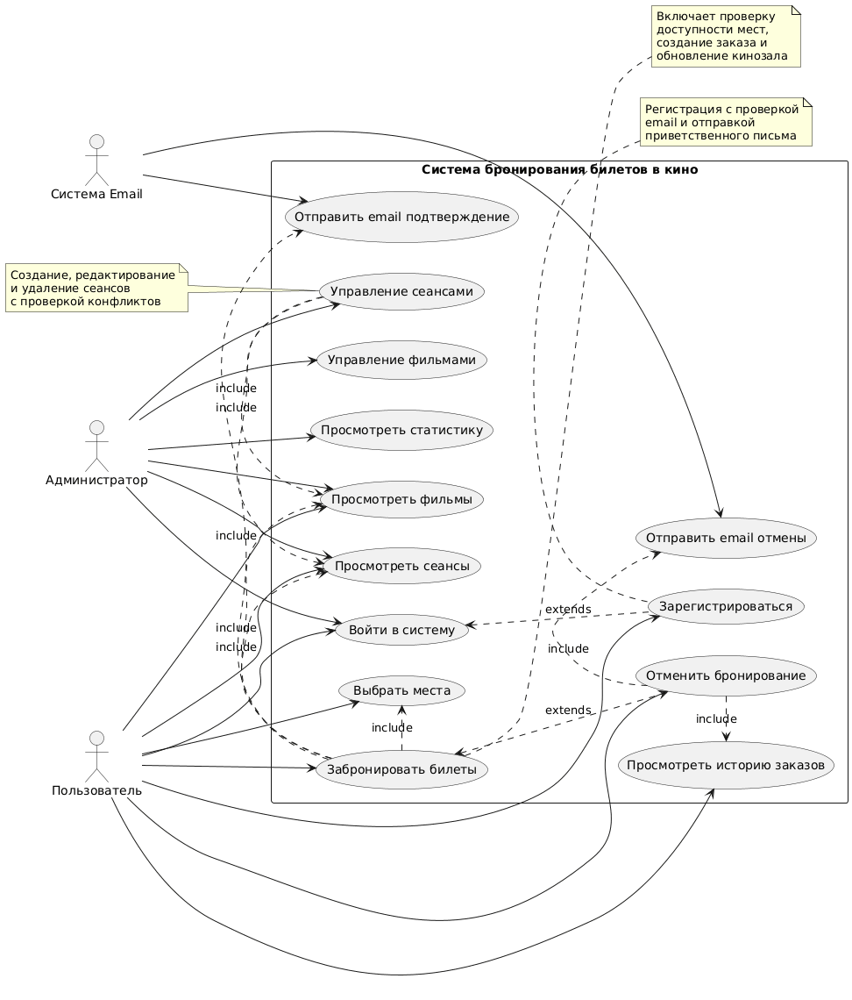

# 📊 Диаграмма вариантов использования Cinema Booking System

# Глоссарий

| Термин | Определение |
|:--|:--|
| Пользователь | Посетитель системы, который может просматривать фильмы, сеансы и регистрироваться |
| Авторизованный пользователь | Зарегистрированный пользователь, который может бронировать билеты и управлять заказами |
| Администратор | Пользователь с расширенными правами, может управлять сеансами, фильмами и статистикой |
| Фильм | Основная сущность системы: содержит название, жанр, язык, цену и продолжительность |
| Сеанс | Временной слот показа фильма в кинозале |
| Кинозал | Зал с определённой конфигурацией мест для сеансов |
| Заказ | Сущность, отражающая бронирование билетов пользователем на определённый сеанс |
| Бронирование | Процесс закрепления выбранных мест за пользователем на определённый сеанс |

---

# Содержание
1 [Актёры](#actors)  
2 [Варианты использования](#use_cases)  
2.1 [Регистрация пользователя](#user_registration)  
2.2 [Авторизация в системе](#user_authentication)  
2.3 [Просмотр фильмов и сеансов](#view_movies_sessions)  
2.4 [Бронирование билетов](#book_tickets)  
2.5 [Просмотр истории заказов](#view_order_history)  
2.6 [Отмена бронирования](#cancel_booking)  
2.7 [Управление сеансами](#manage_sessions)  
2.8 [Управление фильмами](#manage_movies)  
2.9 [Просмотр статистики](#view_statistics)  

---

# 1 Актёры

| Актёр | Описание |
|:--|:--|
| Гость | Неавторизованный посетитель, который может просматривать фильмы и сеансы, регистрироваться и авторизоваться |
| Авторизованный пользователь | Зарегистрированный пользователь, который может бронировать билеты, просматривать и отменять свои заказы |
| Администратор | Пользователь с правами управления системой: может создавать сеансы, управлять фильмами и просматривать статистику |
| Email Service | Внешняя система для отправки уведомлений и подтверждений |

---

# 2 Варианты использования

---

## 2.1 Регистрация пользователя

**Описание.** Позволяет новому пользователю создать учётную запись в системе.  
**Предусловия.** Пользователь не авторизован в системе.  
**Основной поток.**
1. Пользователь нажимает "Регистрация" на главной странице;
2. Система отображает форму регистрации;
3. Пользователь вводит имя, фамилию, email и пароль;
4. Система проверяет корректность данных и уникальность email;
5. Если данные валидны, система создаёт новую учётную запись;
6. Система отправляет приветственное email-письмо;
7. Пользователь получает уведомление об успешной регистрации;
8. Система перенаправляет на страницу авторизации.

**Альтернативный поток А1.**  
1. Введённый email уже существует в системе;
2. Система отображает сообщение об ошибке;
3. Пользователь исправляет email и повторяет попытку.

**Альтернативный поток А2.**  
1. Введены невалидные данные (некорректный email, короткий пароль);
2. Система отображает сообщения об ошибках валидации;
3. Пользователь исправляет данные и повторяет попытку.

---

## 2.2 Авторизация в системе

**Описание.** Позволяет пользователю войти в свою учётную запись.  
**Предусловия.** Пользователь зарегистрирован в системе.  
**Основной поток.**
1. Пользователь нажимает "Вход" на главной странице;
2. Система отображает форму авторизации;
3. Пользователь вводит email и пароль;
4. Система проверяет учётные данные;
5. Если данные верны, система генерирует JWT токен;
6. Система сохраняет токен в сессии;
7. Пользователь перенаправляется в каталог фильмов;
8. Вариант использования завершается.

**Альтернативный поток А1.**  
1. Введён неверный email или пароль;
2. Система отображает сообщение об ошибке авторизации;
3. Пользователь исправляет данные и повторяет попытку.

**Альтернативный поток А2.**  
1. Пользователь не зарегистрирован;
2. Система предлагает перейти к регистрации;
3. Пользователь переходит к варианту использования "Регистрация пользователя".

---

## 2.3 Просмотр фильмов и сеансов

**Описание.** Позволяет пользователю просматривать доступные фильмы и расписание сеансов.  
**Предусловия.** Система загружена и доступна.  
**Основной поток.**
1. Пользователь открывает главную страницу или каталог фильмов;
2. Система отправляет запросы к `/api/movies` и `/api/sessions`;
3. Сервер возвращает списки фильмов и сеансов;
4. Система отображает фильмы в виде карточек с информацией;
5. Для каждого фильма отображается расписание доступных сеансов;
6. Пользователь может фильтровать фильмы по жанру, языку или дате;
7. Вариант использования завершается.

**Альтернативный поток А1.**  
1. Пользователь выбирает конкретный фильм;
2. Система отображает детальную информацию о фильме;
3. Показывает все доступные сеансы для этого фильма.

---

## 2.4 Бронирование билетов

**Описание.** Позволяет авторизованному пользователю забронировать билеты на выбранный сеанс.  
**Предусловия.** Пользователь авторизован и выбрал сеанс.  
**Основной поток.**
1. Пользователь выбирает фильм и сеанс;
2. Система отображает схему зала с доступными местами;
3. Пользователь выбирает одно или несколько мест;
4. Система проверяет доступность выбранных мест;
5. Если места свободны, система создаёт заказ;
6. Система обновляет информацию о занятых местах в кинозале;
7. Отправляется email-подтверждение бронирования;
8. Пользователь получает подтверждение бронирования.

**Альтернативный поток А1.**  
1. Выбранные места уже заняты;
2. Система отображает сообщение о занятых местах;
3. Пользователь выбирает другие места и повторяет попытку.

**Альтернативный поток А2.**  
1. Пользователь не авторизован;
2. Система предлагает авторизоваться или зарегистрироваться;
3. Пользователь переходит к авторизации.

---

## 2.5 Просмотр истории заказов

**Описание.** Позволяет пользователю просмотреть историю своих бронирований.  
**Предусловия.** Пользователь авторизован.  
**Основной поток.**
1. Пользователь нажимает "Мои заказы" в личном кабинете;
2. Система отправляет запрос `/api/orders/user/{userId}`;
3. Сервер возвращает список заказов пользователя;
4. Система отображает заказы в хронологическом порядке;
5. Для каждого заказа отображается детальная информация;
6. Пользователь может просмотреть детали любого заказа;
7. Вариант использования завершается.

**Альтернативный поток А1.**  
1. У пользователя нет заказов;
2. Система отображает сообщение "Заказов не найдено";
3. Предлагает перейти к бронированию билетов.

---

## 2.6 Отмена бронирования

**Описание.** Позволяет пользователю отменить ранее сделанное бронирование.  
**Предусловия.** Пользователь авторизован и имеет активные заказы.  
**Основной поток.**
1. Пользователь открывает историю заказов;
2. Выбирает заказ для отмены;
3. Система проверяет возможность отмены (время до сеанса);
4. Пользователь подтверждает отмену;
5. Система освобождает места в кинозале;
6. Удаляет запись заказа;
7. Отправляет email-уведомление об отмене;
8. Пользователь получает подтверждение отмены.

**Альтернативный поток А1.**  
1. Заказ нельзя отменить (менее часа до сеанса);
2. Система отображает сообщение о невозможности отмены;
3. Вариант использования завершается.

---

## 2.7 Управление сеансами

**Описание.** Позволяет администратору создавать и управлять сеансами.  
**Предусловия.** Пользователь авторизован как администратор.  
**Основной поток.**
1. Администратор открывает панель управления;
2. Выбирает "Управление сеансами";
3. Система отображает список всех сеансов;
4. Администратор создаёт новый сеанс, указывая фильм, время и зал;
5. Система проверяет отсутствие конфликтов по времени и залу;
6. Создаётся новый сеанс;
7. Система обновляет список сеансов;
8. Администратор получает подтверждение создания.

**Альтернативный поток А1.**  
1. Обнаружен конфликт по времени или залу;
2. Система отображает сообщение о конфликте;
3. Администратор изменяет параметры сеанса и повторяет попытку.

---

## 2.8 Управление фильмами

**Описание.** Позволяет администратору добавлять и редактировать информацию о фильмах.  
**Предусловия.** Пользователь авторизован как администратор.  
**Основной поток.**
1. Администратор открывает панель управления;
2. Выбирает "Управление фильмами";
3. Система отображает список всех фильмов;
4. Администратор добавляет новый фильм с информацией;
5. Система сохраняет фильм в базу данных;
6. Фильм становится доступен для бронирования;
7. Администратор получает подтверждение добавления.

**Альтернативный поток А1.**  
1. Администратор редактирует существующий фильм;
2. Система сохраняет изменения;
3. Обновлённая информация становится доступна пользователям.

---

## 2.9 Просмотр статистики

**Описание.** Позволяет администратору просматривать статистику бронирований и доходов.  
**Предусловия.** Пользователь авторизован как администратор.  
**Основной поток.**
1. Администратор открывает панель управления;
2. Выбирает "Статистика";
3. Система отображает dashboard с ключевыми метриками;
4. Администратор может фильтровать статистику по периодам;
5. Система показывает популярные фильмы, загрузку залов, доходы;
6. Администратор анализирует данные для принятия решений;
7. Вариант использования завершается.